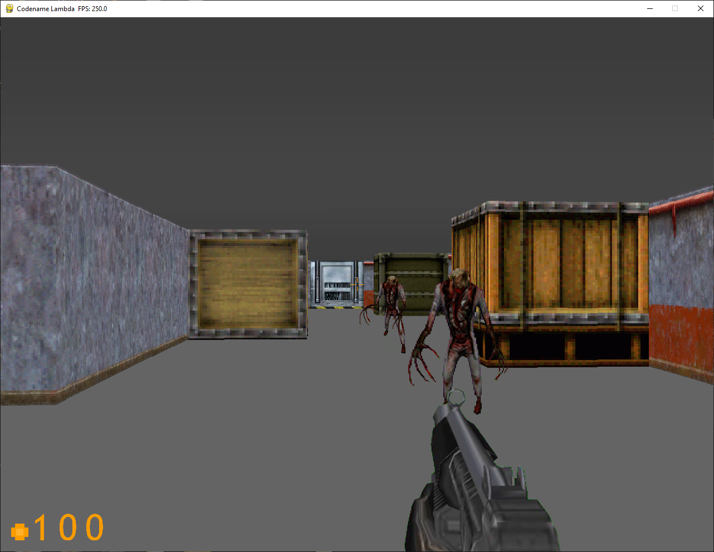

# Python Raycast FPS

This project was developed as a college assignment over approximately two weeks. Drawing inspiration from classic shooters like **Half-Life 1** and **Doom**, the game is a **2.5D first-person shooter** built with Python and the [Pygame](https://www.pygame.org/) library. The goal was to replicate the atmosphere and gameplay of retro shooters within a simplified engine.



## Features

- 3 Unique Weapons – Classic FPS arsenal to take on enemies
- 2 Enemy Types – Different behaviors and attack patterns
- 3 "Chapters" / Levels – With smooth transitions and progression
- Editable Map Files – Customize or create new maps
- Interactive Entities – Doors, health pickups, and level markers
- Soundtrack Support - (music files omitted due to copyright)

## Requirements

- Python 3.x
- Pygame (`pip install pygame`)

## Getting Started

1. Clone the repository:

   ```bash
   git clone https://github.com/DylanAlmond/Python-Raycast-FPS
   cd Python-Raycast-FPS
   ```

2. Run the game:

   ```bash
   python main.py
   ```
